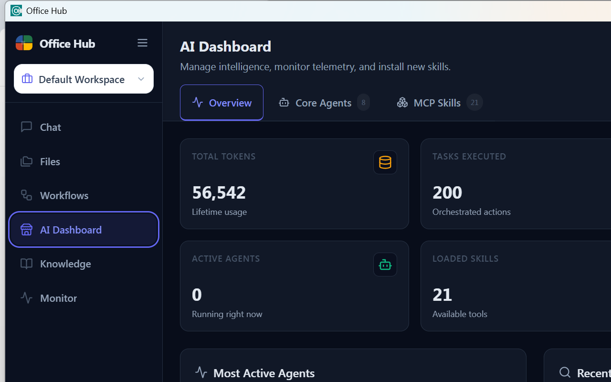
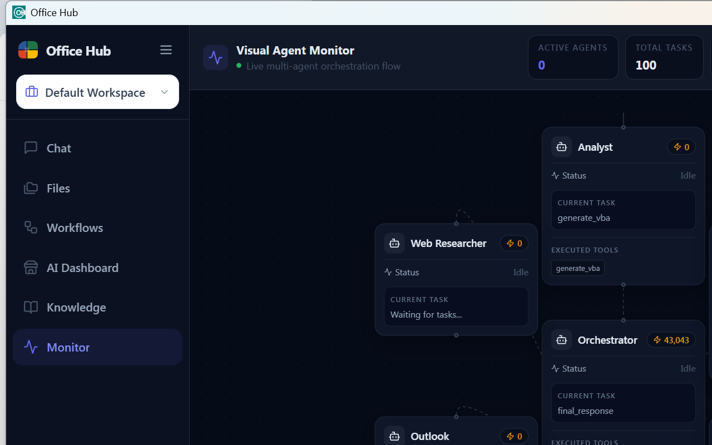

# 🏢 Office Hub AI

[](https://github.com/cuongdm75/office_hub/actions)
[](CHANGELOG.md)
[](LICENSE)
[](https://tauri.app)
[](https://www.rust-lang.org)
[](#-e2e-test-results)

*(Tiếng Việt ở bên dưới / Vietnamese below)*

---

## 🇬🇧 English

> **Office Hub AI** — A lightweight, agentic overlay deeply integrated into Microsoft Office. It automates workflows from Web to Office via a multi-agent orchestration architecture powered by an independent Model Context Protocol (MCP) ecosystem running entirely on your local machine.

Office Hub is an open-source Desktop + Mobile companion that brings autonomous AI agents to your PC. It can manipulate Excel spreadsheets, draft Word documents, analyze data with Polars SQL, conduct deep web research, and orchestrate complex multi-step workflows—all **locally**, without exposing your sensitive documents to untrusted third-party clouds.

---

### 📸 System Screenshots

#### Desktop Interface — Chat & History

*Dark-mode multi-agent chat interface with workspace isolation, categorized session history, and real-time agent status.*

#### Desktop Interface — AI Dashboard & Telemetry

*Real-time telemetry dashboard: total token consumption, task count, active agents, and 21 loaded MCP skills.*

#### Desktop Interface — Visual Agent Monitor

*DAG-based live orchestration view showing all agents (Orchestrator, Web Researcher, Analyst, Outlook) with real-time task and token telemetry.*

#### Mobile Companion App (React Native)

*Secure mobile companion connecting to your desktop AI hub via QR Code pairing or manual IP+token entry over SSE+REST.*

---

### ✨ Key Features

| Feature | Description |
|---|---|
| **Multi-Agent Orchestrator** | Autonomous AI ecosystem (Orchestrator, Web Researcher, Office Master, Analyst, Outlook) collaborating via MCP. Routes user intent automatically using `rule_engine.rs`. |
| **Office Mastery (COM + Add-in)** | Automatically generates, edits, formats, and extracts data from **Word**, **Excel**, and **PowerPoint** via native Win32 COM automation and an embedded Office.js Add-in. |
| **15 Built-in MCP Tools** | Internal skills including: `office_master`, `analyst`, `web_researcher`, `office_com_server`, `outlook`, `search_server`, `analytic_server`, `chart_server`, `native_chart_server`, `folder_scanner`, `converter`, `win32_admin`, `web_fetch_server`, `memory_server`, `system`. |
| **Polars SQL Analytics** | Blazing-fast in-process data processing for millions of rows. Renders dynamic **ECharts** and **native chart images** automatically from data. |
| **Web Researcher** | Deep web search and structured web-page content extraction using an integrated headless engine (`obscura`). |
| **Knowledge Base** | Persistent local knowledge store with Markdown editing. Attach files and notes to workspaces for AI context injection. |
| **Workflow Builder** | Visual node-based workflow editor (React Flow) for designing and saving multi-step agent automation pipelines. |
| **Visual Agent Monitor** | Real-time DAG view of the live orchestration graph, showing each agent's current task, tool executions, and token consumption. |
| **AI Dashboard** | LLM telemetry across all providers: total requests, success/failure rates per model, token usage per agent, cache hit rate, and fallback count. |
| **Multi-Provider LLM Gateway** | Hybrid LLM gateway supporting **Gemini**, **OpenAI**, **Anthropic**, and **local Ollama** with automatic fallback routing. |
| **Workspace Isolation** | Chat history, context, memory, and files are completely isolated by workspace using SQLite partitioning. |
| **Mobile Companion** | Real-time control of desktop agents from an Android/iOS app via secure SSE + REST architecture. QR Code pairing support. |
| **Office Add-in** | Embedded HTTPS server serves the Office.js add-in panel directly inside Word/Excel/Outlook with zero separate server required. |
| **Theme Engine** | Full Light / Dark / System theme support with persistent preference, applied via CSS custom properties. |
| **CRDT Sync** | Conflict-free replicated data types for real-time collaborative session state between desktop and mobile. |

---

### 🛠️ Full Tech Stack

| Layer | Technology |
|---|---|
| **Core Backend** | Rust 1.80+, Tauri v2, Axum (HTTP/SSE), Tokio async runtime, Rusqlite |
| **Data Processing** | Polars (DataFrame SQL engine), Plotters (native chart rendering) |
| **Networking** | WebSocket (port 9001), SSE+REST hybrid (port 9002), embedded HTTPS (port 3000) |
| **Desktop Frontend** | React 18, TypeScript, Vite, Tailwind CSS v3, Zustand, ECharts, React Flow (`@xyflow/react`) |
| **Mobile Companion** | React Native, Expo, Zustand, React Navigation |
| **Office Integration** | Win32 COM APIs, Office.js Web Add-ins (React + Vite), `office-addin-dev-certs` |
| **AI Infrastructure** | Model Context Protocol (MCP), GenAI multi-provider gateway (Gemini, OpenAI, Anthropic, Ollama) |
| **Persistence** | SQLite (per-workspace), local filesystem knowledge store |

---

### ✅ E2E Test Results

All 7 integration tests pass against the live backend:

```
============================================================
  Office Hub - E2E Office Add-in WebSocket Tests
  Target: ws://127.0.0.1:9001
============================================================
  [OK] [134ms]   PASS: Connect & Auth
  [OK] [1542ms]  PASS: Reconnect Resilience (3 cycles)
  [OK] [16777ms] PASS: ChatRequest - Basic Reply
  [OK] [5554ms]  PASS: ChatRequest - With Document Content
  [OK] [1ms]     PASS: Ping/Pong
  [OK] [3000ms]  PASS: OfficeAddinEvent - DocumentOpened (Word)
  [OK] [3015ms]  PASS: OfficeAddinEvent - Outlook Email

  Result: 7/7 tests passed
============================================================
```

Run the suite anytime: `python test/e2e_addin_ws.py`

---

### 🚀 Getting Started (End Users — No Code Required)

#### Step 1 — Download
Go to [Releases](https://github.com/cuongdm75/office_hub/releases/latest) and download:
- `OfficeHub-Setup.exe` — Windows desktop installer
- `OfficeHub.apk` — Android companion app (optional)

#### Step 2 — Install & Launch
Double-click `OfficeHub-Setup.exe`. Open **Office Hub AI** from your Desktop shortcut.

#### Step 3 — Configure AI
On first launch, open **Settings** (gear icon at the bottom of the sidebar) → **LLM** tab.  
Enter an API key for at least one provider (Google Gemini, OpenAI, or Anthropic). Local Ollama is detected automatically.

#### Step 4 — Install the Office Add-in
1. Open Microsoft Word or Excel.
2. Click **Insert** → **Get Add-ins** → **My Add-ins** → **Upload My Add-in**.
3. Select `manifest.xml` from the release package.
4. The Office Hub panel appears on the right side of your document!

> **Alternative (Registry):** Run `.\install_addin_ribbon.ps1` as Administrator to install the add-in via the Windows Registry for all Office apps at once.

#### Step 5 — Connect Mobile (Optional)
Install `OfficeHub.apk` on your Android phone. In the desktop app, navigate to **Settings → Mobile** tab to reveal the QR code, then scan it from your phone to pair instantly.

---

### 💻 Developer Guide

#### Prerequisites
- **OS:** Windows 10/11 64-bit (required for COM automation and Office Add-in)
- **Rust:** 1.80+ (`rustup update stable`)
- **Node.js:** 20+
- **Microsoft Office:** 2016 / 2019 / 2021 / 365

#### Local Setup

```powershell
# 1. Clone
git clone https://github.com/cuongdm75/office_hub.git
cd office_hub

# 2. Install all dependencies
npm install
cd office-addin && npm install
cd ../mobile && npm install
cd ..

# 3. Start full stack (Vite dev + Rust backend + embedded add-in server)
npm run tauri:dev
```

The startup script `.\Start-OfficeHub.ps1` can also be used for running only the pre-built binary (no Rust recompile):
```powershell
# Requires: cargo build completed in src-tauri/
.\Start-OfficeHub.ps1
```

#### Build for Production

```powershell
# Desktop (.exe + .msi installer)
npm run tauri:build

# Mobile (.apk via EAS)
cd mobile
npx eas-cli build -p android --profile preview
```

#### Run E2E Tests

```powershell
# Backend must be running first
python test/e2e_addin_ws.py
```

---

### 📁 Project Structure

```
office-hub/
├── src/                    # React desktop frontend (Chat, Files, Workflows, Monitor…)
│   ├── components/
│   │   ├── ChatPane/       # Main chat UI + session history sidebar
│   │   ├── AgentMonitor/   # Real-time DAG agent visualization (React Flow)
│   │   ├── AgentManager/   # AI Dashboard + MCP skill manager
│   │   ├── FileBrowser/    # Workspace file browser
│   │   ├── KnowledgeBase/  # Local knowledge store with Markdown editor
│   │   ├── WorkflowBuilder/# Visual workflow node editor
│   │   └── Settings/       # LLM config, system, mobile pairing
│   └── store/              # Zustand global state
├── src-tauri/src/          # Rust backend
│   ├── agents/             # Agent implementations (office_master, analyst, web_researcher, outlook, converter…)
│   ├── mcp/                # MCP broker + 15 internal tool servers
│   ├── llm_gateway/        # Hybrid multi-provider LLM gateway with fallback
│   ├── orchestrator/       # Intent routing + rule engine
│   ├── websocket/          # WebSocket server (port 9001, Office Add-in protocol)
│   ├── sse_server.rs       # SSE+REST server (port 9002, mobile companion)
│   ├── knowledge.rs        # Persistent knowledge base engine
│   └── workflow/           # Workflow execution engine
├── office-addin/           # Office.js Add-in (Word/Excel/Outlook panel)
├── mobile/                 # React Native companion app
├── test/                   # E2E test suite
│   └── e2e_addin_ws.py     # WebSocket protocol integration tests (7 tests)
└── mcp-servers/            # Example external MCP server (extensibility)
```

---

### 🔌 Extending via MCP Servers

Office Hub is built on an open MCP architecture. You can add custom tools without touching the Rust core.

**1. Write a server** in any language (Python, TypeScript, Go, Rust):
```python
# my_crm_server.py — exposes a CRM lookup tool
from mcp.server import MCPServer
server = MCPServer("crm")

@server.tool("get_contract")
def get_contract(contract_id: str) -> str:
    return f"Contract {contract_id}: ..."
```

**2. Register it** in `config.yaml`:
```yaml
mcp_servers:
  my-crm:
    command: "python"
    args: ["/path/to/my_crm_server.py"]
```

**3. Agents auto-discover** the new tool on next startup and route user requests to it automatically.

**4. Custom Agents:** Define new agents in `src-tauri/src/agents/`. The Orchestrator's `rule_engine.rs` will automatically route matching user intents to your agent.

---
---

## 🇻🇳 Tiếng Việt

> **Office Hub AI** — Trợ lý AI siêu nhẹ, tích hợp sâu vào Microsoft Office. Tự động hóa quy trình từ Web đến Office thông qua kiến trúc đa Agent điều phối và hệ sinh thái **15 MCP tools** nội bộ, hoạt động hoàn toàn cục bộ trên máy tính của bạn.

---

### 📸 Ảnh chụp màn hình

#### Giao diện Desktop — Chat & Lịch sử

*Giao diện Dark Mode với bộ chọn Workspace, lịch sử chat phân loại, và trạng thái Agent theo thời gian thực.*

#### Giao diện Desktop — AI Dashboard

*Dashboard telemetry: tổng token tiêu thụ, số tác vụ, agents hoạt động, và 21 MCP Skills được nạp.*

#### Giao diện Desktop — Visual Agent Monitor

*Đồ thị DAG trực quan theo dõi toàn bộ luồng điều phối đa Agent theo thời gian thực.*

#### Ứng dụng Mobile (React Native)

*Kết nối bảo mật bằng QR Code hoặc nhập thủ công IP + token để điều khiển AI từ điện thoại.*

---

### ✨ Tính năng nổi bật

| Tính năng | Mô tả |
|---|---|
| **Multi-Agent Orchestrator** | Hệ điều phối đa đặc vụ (Orchestrator, Web Researcher, Office Master, Analyst, Outlook) hợp tác qua MCP. |
| **Office Mastery** | Tự động tạo, sửa, định dạng Word/Excel/PowerPoint qua Win32 COM + Office.js Add-in nhúng. |
| **15 MCP Tools nội bộ** | `office_master`, `analyst`, `web_researcher`, `outlook`, `search_server`, `analytic_server`, `chart_server`, `native_chart_server`, `folder_scanner`, `converter`, `win32_admin`, `web_fetch_server`, `memory_server`, `system`, `office_com_server`. |
| **Polars SQL Analytics** | Xử lý hàng triệu dòng dữ liệu tốc độ cao, tự động xuất biểu đồ ECharts và ảnh chart nội bộ. |
| **Web Researcher** | Nghiên cứu web chuyên sâu với engine trình duyệt ẩn danh `obscura`. |
| **Knowledge Base** | Kho lưu trữ kiến thức cục bộ với trình soạn Markdown, gắn file theo từng Workspace. |
| **Workflow Builder** | Trình thiết kế luồng công việc dạng node trực quan (React Flow). |
| **Visual Agent Monitor** | Đồ thị DAG theo dõi trực tiếp từng Agent: tác vụ hiện tại, công cụ đang chạy, token tiêu thụ. |
| **AI Dashboard** | Thống kê telemetry: requests, tỷ lệ thành công/thất bại theo model, token theo agent, cache hits. |
| **LLM Gateway đa nhà cung cấp** | Hỗ trợ Gemini, OpenAI, Anthropic, Ollama cục bộ với tự động fallback. |
| **Workspace Isolation** | Cách ly tuyệt đối chat, ngữ cảnh, memory, file theo từng dự án qua SQLite partitioning. |
| **Mobile Companion** | Điều khiển AI từ Android/iOS qua SSE+REST. Ghép nối bằng QR Code. |

---

### 🛠️ Công nghệ

| Tầng | Công nghệ |
|---|---|
| **Core Backend** | Rust 1.80+, Tauri v2, Axum, Tokio, Rusqlite |
| **Xử lý dữ liệu** | Polars (DataFrame SQL), Plotters (chart ảnh nội bộ) |
| **Mạng** | WebSocket (cổng 9001), SSE+REST (cổng 9002), HTTPS nhúng (cổng 3000) |
| **Frontend Desktop** | React 18, TypeScript, Vite, Tailwind CSS v3, Zustand, ECharts, React Flow |
| **Mobile** | React Native, Expo, Zustand, React Navigation |
| **Office** | Win32 COM APIs, Office.js Add-in (React + Vite) |
| **AI** | MCP, LLM Gateway đa nhà cung cấp (Gemini, OpenAI, Anthropic, Ollama) |

---

### 🚀 Hướng dẫn cài đặt (Người dùng — Không cần lập trình)

1. **Tải phần mềm:** Truy cập [trang Releases](https://github.com/cuongdm75/office_hub/releases/latest), tải `OfficeHub-Setup.exe` và `OfficeHub.apk` (tùy chọn).

2. **Cài đặt Desktop:** Nháy đúp `OfficeHub-Setup.exe`. Mở Office Hub AI từ màn hình Desktop.

3. **Cấu hình AI:** Vào **Settings** (biểu tượng bánh răng) → tab **LLM** → nhập API Key (Gemini, OpenAI, Anthropic, hoặc để trống nếu dùng Ollama).

4. **Cài Add-in vào Office:**
   - Mở Word hoặc Excel → **Insert** → **Get Add-ins** → **My Add-ins** → **Upload My Add-in**.
   - Chọn file `manifest.xml` trong gói cài đặt.
   - Hoặc chạy `.\install_addin_ribbon.ps1` (quyền Admin) để cài vào toàn bộ ứng dụng Office.

5. **Kết nối Mobile (Tùy chọn):** Cài `OfficeHub.apk` → Vào **Settings → Mobile** trên Desktop để lấy QR Code → Quét từ điện thoại.

---

### 💻 Hướng dẫn cho Lập trình viên

#### Yêu cầu hệ thống
- **OS:** Windows 10/11 (64-bit) — bắt buộc cho COM và Office Add-in
- **Rust:** 1.80+ (`rustup update stable`)
- **Node.js:** 20+
- **Microsoft Office:** 2016 / 2019 / 2021 / 365

#### Cài đặt và Chạy Dev

```powershell
git clone https://github.com/cuongdm75/office_hub.git
cd office_hub
npm install
cd office-addin && npm install
cd ../mobile && npm install
cd ..
npm run tauri:dev
```

#### Build bản chính thức

```powershell
npm run tauri:build          # Desktop (.exe + .msi)
cd mobile
npx eas-cli build -p android --profile preview   # Mobile (.apk)
```

#### Chạy E2E Tests

```powershell
python test/e2e_addin_ws.py   # 7/7 tests pass
```

---

### 🔌 Mở rộng bằng MCP Server

```yaml
# config.yaml — đăng ký plugin tùy chỉnh
mcp_servers:
  plugin-crm-noi-bo:
    command: "python"
    args: ["/duong/dan/toi/crm_server.py"]
```

Khi khởi động lại, các Agent sẽ tự động nhận diện và sử dụng công cụ mới. Để tạo Agent hoàn toàn mới, định nghĩa trong `src-tauri/src/agents/` — Orchestrator sẽ tự route qua `rule_engine.rs`.

---

*Copyright © Office Hub AI Contributors — MIT License*