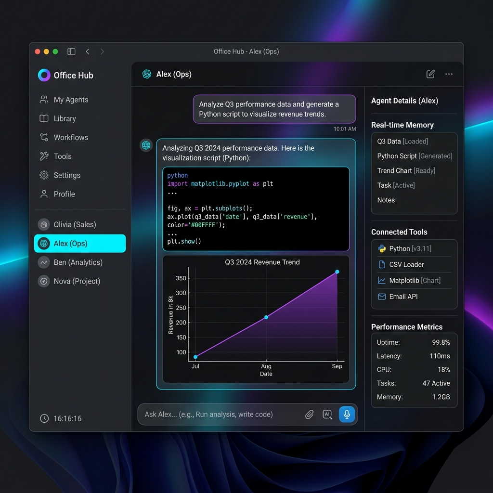
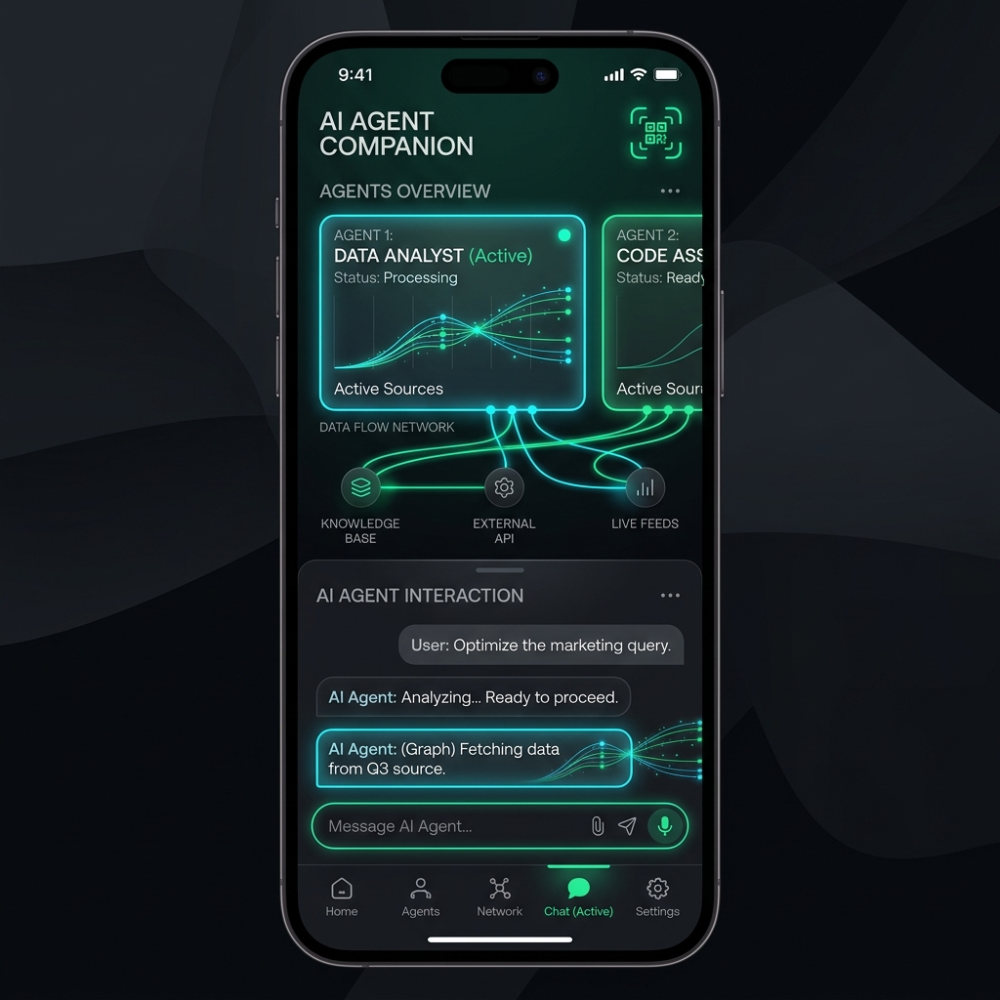

# 🏢 Office Hub AI

[]()
[](CHANGELOG.md)
[](LICENSE)
[](https://tauri.app)
[](https://www.rust-lang.org)

*(Tiếng Việt ở bên dưới / Vietnamese below)*

---

## 🇬🇧 English

> **Office Hub AI** — A lightweight, agentic overlay deeply integrated into Microsoft Office. It automates workflows from Web to Office via a multi-agent orchestration architecture and an independent Model Context Protocol (MCP) ecosystem.

Office Hub is an open-source Desktop and Mobile companion application that brings autonomous AI agents to your local machine, allowing you to manipulate Excel spreadsheets, draft Word documents, analyze data with Polars, and conduct web research—all locally without exposing your sensitive documents to untrusted 3rd party clouds.

### 📸 System Screenshots

#### Desktop Interface (Tauri + React)

*Modern dark-mode multi-agent chat interface with real-time memory tracking and status metrics.*

#### Mobile Companion App (React Native)

*Remote dashboard connecting securely to your desktop agents via local network.*

### ✨ Key Features for Users
- **Multi-Agent Orchestrator:** An advanced AI ecosystem (Web Researcher, Office Master, Analyst) collaborating autonomously via Model Context Protocol (MCP).
- **Office Mastery:** Automatically generates, edits, and extracts data from Word documents, Excel spreadsheets, and PowerPoint presentations via native Win32 COM and Office.js Add-ins.
- **Analytic & Chart Engine:** Blazing-fast data processing using **Polars SQL**, capable of transforming millions of rows and rendering dynamic ECharts automatically.
- **Web Researcher:** Deep web searching and visual layout extraction using an integrated headless browser engine (`obscura`).
- **Mobile Companion:** Real-time remote control of your Desktop agents via the Office Hub Mobile app using secure SSE + REST architecture.
- **Workspace Isolation:** Your chats, context histories, and files are completely isolated by project workspace to ensure absolute data privacy.

### 🛠️ Full Tech Stack

Office Hub utilizes a bleeding-edge technology stack optimized for performance, security, and developer experience:

- **Core Backend:** Rust, Tauri v2, Axum (HTTP/SSE Server), Tokio (Async runtime), Polars (Dataframe), Reqwest, Rusqlite
- **Desktop Frontend:** React 18, TypeScript, Vite, Tailwind CSS v3, Zustand (State Management), ECharts, React Flow
- **Mobile Companion:** React Native, Expo, Zustand, React Navigation
- **Office Integration:** Microsoft Win32 COM APIs, Office.js Web Add-ins (React + Vite)
- **AI Infrastructure:** Model Context Protocol (MCP), GenAI framework (with multi-provider support: Gemini, OpenAI, Anthropic, Local Ollama)

### 🚀 Getting Started (End Users)

To use Office Hub immediately without compiling code:

1. **Download the Release:** Go to the [Releases page]() and download `OfficeHub-Setup.exe` (Desktop) and `OfficeHub.apk` (Android).
2. **Install Desktop App:** Run the `.exe` installer. 
3. **Configure LLM:** On the first launch, go to the Settings tab to enter your API Keys (Gemini, OpenAI, or Local Ollama).
4. **Install Office Add-ins:** 
   - Open Word/Excel -> `Insert` -> `Add-ins` -> `My Add-ins` -> `Upload My Add-in`.
   - Select the `manifest.xml` provided in the release package.
5. **Connect Mobile:** Open the Mobile App, enter your Desktop IP address and pair it using the QR code.

---

### 💻 Developer Guide (Open Source)

We welcome contributions! Please review the tech stack above before starting.

#### Prerequisites
- **OS:** Windows 10/11 (64-bit) is required for COM automation and Office Add-in features.
- **Rust:** 1.80+ (`rustup update stable`)
- **Node.js:** 20+
- **Microsoft Office:** 2016 / 2019 / 2021 / 365 (Developer Registry enabled)

#### Local Setup & Development

1. **Clone the repository:**
   ```powershell
   git clone https://github.com/cuongdm75/office_hub.git
   cd office_hub
   ```

2. **Install Dependencies:**
   ```powershell
   npm install
   cd office-addin && npm install
   cd ../mobile && npm install
   ```

3. **Run the Application:**
   To start the full stack (Tauri Desktop App + Backend Server + Office Add-in Dev Server):
   ```powershell
   .\Start-OfficeHub.ps1
   ```
   *Note: This script will automatically install local HTTPS certificates required by Office Add-ins.*

4. **Build for Production:**
   ```powershell
   # Build Desktop (.exe / .msi)
   npm run tauri:build

   # Build Mobile (.apk)
   cd mobile
   npx eas-cli build -p android --profile preview
   ```

#### Project Structure
- `src-tauri/`: Rust backend, Agent Orchestrator, LLM Gateway, Axum servers.
- `src/`: Tauri React Frontend (Dashboard, Chat UI).
- `office-addin/`: Office Web Add-in for seamless Word/Excel/PPT extraction.
- `mobile/`: React Native mobile companion app.
- `mcp-servers/`: Independent Python/Rust servers communicating via MCP Protocol.

---
---

## 🇻🇳 Tiếng Việt

> **Office Hub AI** — Trợ lý AI siêu nhẹ, tích hợp sâu vào Microsoft Office, tự động hóa quy trình từ Web đến Office thông qua kiến trúc đa Agent điều phối và hệ sinh thái MCP (Model Context Protocol) độc lập.

Office Hub là dự án mã nguồn mở (Open Source) bao gồm ứng dụng Desktop và Mobile, mang sức mạnh của AI Agents xuống máy tính cá nhân của bạn. Ứng dụng có thể tự động xử lý bảng tính Excel, soạn thảo Word, phân tích dữ liệu với Polars, và nghiên cứu Web—tất cả diễn ra cục bộ, đảm bảo tính bảo mật dữ liệu tuyệt đối.

### 📸 Ảnh chụp màn hình hệ thống

#### Giao diện Ứng dụng Desktop (Tauri + React)

*Giao diện Dark Mode hiện đại, tích hợp chat đa luồng Agent cùng trình theo dõi bộ nhớ theo thời gian thực.*

#### Giao diện Ứng dụng Mobile (React Native)

*Ứng dụng Mobile đồng hành kết nối bảo mật qua mạng LAN để điều khiển và giám sát tiến trình hệ thống từ xa.*

### ✨ Tính năng nổi bật
- **Hệ thống Multi-Agent:** Kiến trúc điều phối đa đặc vụ (Web Researcher, Office Master, Analyst) phối hợp tự chủ thông qua giao thức MCP.
- **Tự động hoá Office Mastery:** Tự động tạo, sửa đổi, định dạng và trích xuất dữ liệu từ Word, Excel, PowerPoint thông qua công nghệ Win32 COM và Office.js Add-ins.
- **Analytic & Chart Engine:** Công cụ phân tích và biểu diễn dữ liệu bằng **Polars SQL**, tốc độ cực nhanh cho hàng triệu dòng, tự động trích xuất các biểu đồ ECharts.
- **Web Researcher:** Máy dò tìm thông tin và nghiên cứu web chuyên sâu tích hợp engine trình duyệt ẩn danh (`obscura`).
- **Mobile Companion:** Điều khiển AI Agents từ xa theo thời gian thực thông qua ứng dụng Mobile bằng kiến trúc bảo mật SSE + REST.
- **Workspace Isolation:** Cách ly tuyệt đối không gian làm việc. Ngữ cảnh, lịch sử chat và các tài liệu được khoanh vùng độc lập theo từng dự án.

### 🛠️ Công nghệ sử dụng (Tech Stack)

Office Hub được xây dựng dựa trên các công nghệ tiên tiến nhất về hiệu năng và bảo mật:

- **Core Backend:** Rust, Tauri v2, Axum (HTTP/SSE Server), Tokio (Async runtime), Polars (Dataframe), Reqwest, Rusqlite
- **Desktop Frontend:** React 18, TypeScript, Vite, Tailwind CSS v3, Zustand, ECharts, React Flow
- **Mobile Companion:** React Native, Expo, Zustand, React Navigation
- **Office Integration:** Microsoft Win32 COM APIs, Office.js Web Add-ins (React + Vite)
- **AI Infrastructure:** Model Context Protocol (MCP), Framework GenAI (Hỗ trợ đa LLM: Gemini, OpenAI, Anthropic, Ollama cục bộ)

### 🚀 Bắt đầu sử dụng (Dành cho Người dùng)

Để sử dụng Office Hub ngay lập tức mà không cần biết lập trình:

1. **Tải phần mềm:** Truy cập trang [Releases]() và tải file `OfficeHub-Setup.exe` (cho Desktop) và `OfficeHub.apk` (cho Android).
2. **Cài đặt Desktop:** Chạy file `.exe` để cài đặt phần mềm.
3. **Cấu hình LLM:** Trong lần chạy đầu tiên, vào mục Settings để nhập API Key (Gemini, OpenAI, hoặc Ollama).
4. **Cài đặt Office Add-in:** 
   - Mở Word/Excel -> `Insert` (Chèn) -> `Add-ins` -> `My Add-ins` -> `Upload My Add-in`.
   - Chọn file `manifest.xml` đi kèm trong gói cài đặt.
5. **Kết nối Mobile:** Mở app trên điện thoại, nhập địa chỉ IP của máy tính (hoặc quét mã QR) để điều khiển từ xa.

---

### 💻 Hướng dẫn cho Lập trình viên (Developer Guide)

Chúng tôi hoan nghênh mọi sự đóng góp mã nguồn! 

#### Yêu cầu hệ thống
- **OS:** Bắt buộc dùng Windows 10/11 (64-bit) để hỗ trợ giao thức COM và Office Add-in.
- **Rust:** 1.80+ (`rustup update stable`)
- **Node.js:** 20+
- **Microsoft Office:** Phiên bản 2016 / 2019 / 2021 / 365 (Yêu cầu bật Developer Registry cho Add-in)

#### Cài đặt và Chạy môi trường Dev

1. **Clone mã nguồn:**
   ```powershell
   git clone https://github.com/cuongdm75/office_hub.git
   cd office_hub
   ```

2. **Cài đặt Dependencies:**
   ```powershell
   npm install
   cd office-addin && npm install
   cd ../mobile && npm install
   ```

3. **Chạy ứng dụng (Development):**
   Để khởi động toàn bộ hệ thống (Tauri Desktop App + Backend Server + Office Add-in Dev Server):
   ```powershell
   .\Start-OfficeHub.ps1
   ```
   *Lưu ý: Script này sẽ tự động cài đặt chứng chỉ HTTPS cục bộ (localhost) bắt buộc cho Office Add-in.*

4. **Build bản chính thức (Production):**
   ```powershell
   # Build Desktop (.exe / .msi)
   npm run tauri:build

   # Build Mobile (.apk)
   cd mobile
   npx eas-cli build -p android --profile preview
   ```

#### Cấu trúc dự án
- `src-tauri/`: Rust backend, bộ điều phối Agent Orchestrator, LLM Gateway, Axum servers.
- `src/`: React Frontend cho app Desktop (Dashboard, Chat UI).
- `office-addin/`: Web Add-in chạy ngầm trong Word/Excel/PPT để đọc xuất dữ liệu.
- `mobile/`: Ứng dụng điện thoại React Native điều khiển từ xa.
- `mcp-servers/`: Các server độc lập (Python/Rust) giao tiếp qua chuẩn MCP (Model Context Protocol).

---
*Bản quyền thuộc về những người đóng góp cho dự án Office Hub AI (MIT License).*